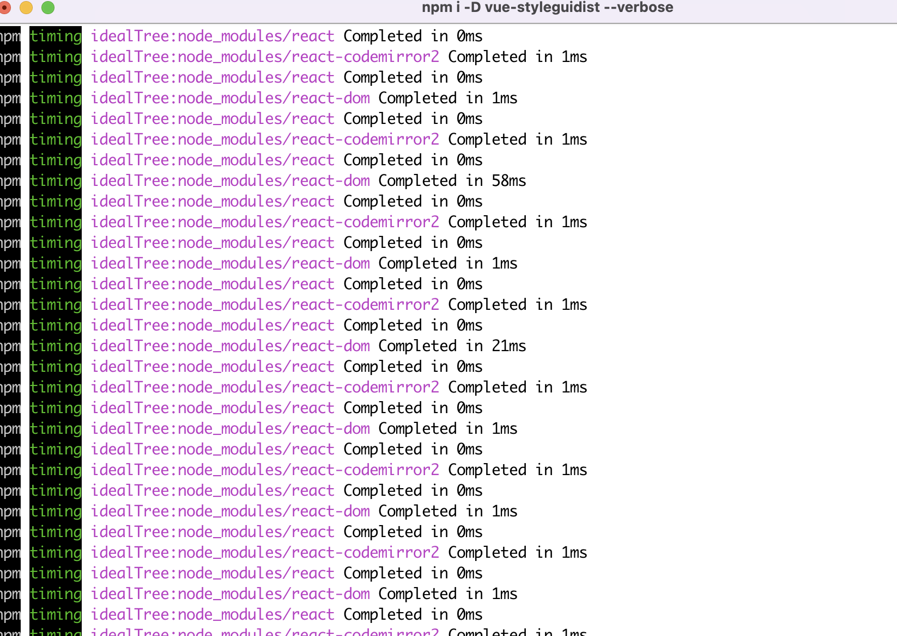

# vue-styleguidist-issue

This will not install.  
Running an `npm i` will hang.  
I believe it is hanging on installing sub-dependencies related to react-dev-tools.

These are the repeating messages when I attempt to install using `npm i vue-styleguidist --verbose`

Because it never completes, there is no npm log.

I attempted with older version of vue-styleguidist as well, such as vue-styleguidist@4.40, but it now gives the same result..

